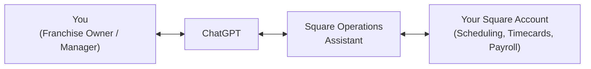

# Square Operations Assistant — Franchise Manager Guide

## Alan Newbold (AI Engine) | developer@e-newbold.com

A ChatGPT-connected assistant that helps franchise owners and managers handle **scheduling, timecards, and payroll/tip reconciliation** for locations running on Square — without leaving a normal ChatGPT conversation.

This guide is written for franchise owners, managers, and operators. No technical background required. If you're the person setting this server up or maintaining it, see [TechnicalGuide.md](TechnicalGuide.md) instead.

## Contents

- [What this is](#what-this-is)
- [What it can help with](#what-it-can-help-with)
- [Getting connected](#getting-connected)
- [What you can ask](#what-you-can-ask)
- [How approvals work](#how-approvals-work)
- [Scheduled automations](#scheduled-automations)
- [Data & privacy basics](#data--privacy-basics)
- [FAQ](#faq)

## What this is

Think of this as a coworker who already has access to your Square account's scheduling and payroll data, and who you talk to right inside ChatGPT. You ask questions or give instructions in plain English; it looks up the real data in Square, does the math, and — for anything that actually changes something (like publishing a schedule or paying out tips) — checks with you before it acts.

Nothing about this replaces Square — it's a faster, conversational way to work with the data that's already there.

## What it can help with

| If this sounds familiar...                                             | The assistant can help by...                                                                                                              |
| ---------------------------------------------------------------------- | ----------------------------------------------------------------------------------------------------------------------------------------- |
| "Building next week's schedule takes me most of a day"                 | Drafting a schedule from your instructions, which you review and publish when ready                                                       |
| "I'm not sure if any timecards have problems before I run payroll"     | Checking every timecard for missed clock-outs, unclosed breaks, double-punches, or missing wage setup                                     |
| "Splitting cash tips fairly is a manual, error-prone process"          | Calculating a fair split (equal or hours-weighted) from your daily cash totals, and showing you the breakdown before anything is recorded |
| "I want to know if anyone's close to overtime before I finalize hours" | Summarizing scheduled hours per team member against the weekly overtime threshold                                                         |
| "I don't want to double check every little schedule change"            | Making changes to a **draft** schedule only — nothing is visible to staff until you say "publish"                                         |

## Getting connected

<strong>Step 1 — Add the connector in ChatGPT</strong>

Ask your administrator or implementation contact for the connector link for your business. Adding it works the same way as adding any other ChatGPT app/connector.

<strong>Step 2 — Sign in with your business identity</strong>

You'll be asked to sign in once with your organization's business account. This is how the assistant knows _which_ franchise location(s) you're authorized to see — no one else's data is ever visible to you, and yours is never visible to them.

<strong>Step 3 — Connect your Square account</strong>

The first time you ask for something that needs Square data, the assistant will notice you're not connected yet and give you a one-time link to connect your Square account. Click it, approve access in Square, and you're done — this only needs to happen once.

You can also just ask: _"Am I connected to Square?"_

Once both steps are done, every tool below is available in any ChatGPT conversation.

## What you can ask

<strong>Scheduling</strong>

- "What shifts are scheduled at [location] next week?"
- "How many hours does each person have scheduled this week, and is anyone close to overtime?"
- "Draft a schedule for next week: [describe who works when]"
- "Move Sarah's Thursday shift to start an hour later" _(on a draft schedule)_
- "Publish this week's draft schedule"

<strong>Payroll & tips</strong>

- "Prep payroll for this pay period"
- "Are there any timecard problems I should fix before running payroll?"
- "Split $340 in cash tips for Saturday across the eligible team"
- "Yes, approved — go ahead and record that" _(after reviewing a tip split)_

<strong>Timecards</strong>

- "Did anyone forget to clock out this week?"
- "Show me any overlapping or double-punched shifts"

## How approvals work

Two kinds of requests behave differently, on purpose:

- **Looking something up** (checking hours, finding timecard issues, previewing a tip split, drafting a schedule) happens immediately — nothing changes in Square yet.
- **Actually changing something** (publishing a schedule so staff can see it, or recording a tip payout) always requires you to explicitly say "yes" or "approved" in the conversation first. The assistant will show you exactly what it's about to do before it does it.

This means you can freely ask "what if" questions and review drafts without any risk — nothing is final until you say so.

## Scheduled automations

If your ChatGPT plan supports scheduled/recurring tasks, you can set one up like _"every Thursday evening, draft next week's schedule and prep payroll for review."_ The read-only and drafting steps will run automatically. Anything that requires your approval — publishing the schedule, recording a tip payout — will pause and wait for you to open the conversation and confirm, rather than happening unattended.

## Data & privacy basics

- Your business sign-in and your Square connection are tied together — only you (and anyone else your organization grants access to) can see your location's data.
- Nothing you ask about is stored anywhere new; the assistant reads directly from your Square account each time and only writes back what you've explicitly approved.
- Scheduling preferences and rules you mention in conversation (who's available when, who can open, etc.) aren't remembered automatically between separate conversations — mention them again if you start a new chat, or keep using the same ongoing conversation/task for continuity.

## FAQ

<strong>Does this replace Square?</strong>

No. Square remains the system of record for your schedules, timecards, and payroll data. This assistant is a faster way to work with that same data conversationally.

<strong>Can it publish a schedule or pay out tips without me knowing?</strong>

No. Both of those are gated actions — they only happen after you've reviewed a preview/draft and explicitly approved it in the conversation.

<strong>What if I manage more than one location?</strong>

You can specify which of your authorized locations you mean by name in any request (e.g., "schedule at the downtown location"). You can only see and act on locations your Square connection is actually authorized for.

<strong>Who do I contact if something looks wrong?</strong>

Contact your implementation/administrator contact — they can review the underlying Square data and connection setup with you.

