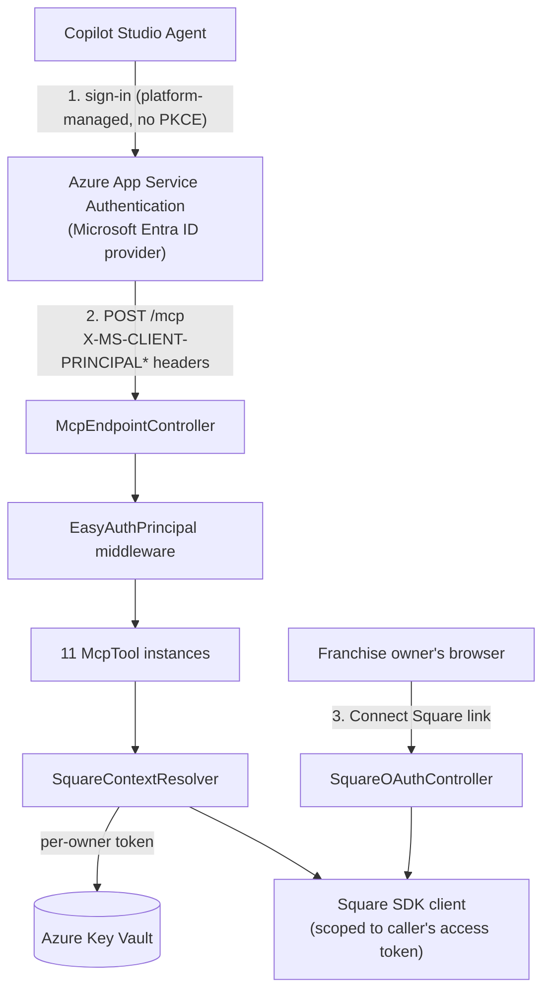

# Square Operations MCP Server — Technical Guide

## Alan Newbold (AI Engine) | developer@e-newbold.com

A self-hosted Node.js/Express [MCP](https://modelcontextprotocol.io) server, designed to run on Azure App Service, that exposes Square Labor operations (scheduling, timecards, payroll/tip reconciliation) as tool calls for franchise restaurant operators using **Microsoft Copilot Studio Agents**.

This guide covers **adopting and integrating** this server as a Copilot Studio custom connector/agent and understanding its tool catalog, identity model, and security posture. It does not cover Azure deployment/infrastructure setup. For the non-technical, owner-facing guide, see [ReadMe.md](ReadMe.md).

## Contents

- [Architecture overview](#architecture-overview)
- [Identity chain](#identity-chain)
- [Tool catalog reference](#tool-catalog-reference)
- [Copilot Studio connector integration](#copilot-studio-connector-integration)
- [Registering as a Power Platform custom connector](#registering-as-a-power-platform-custom-connector)
- [Security model summary](#security-model-summary)
- [Known limitations](#known-limitations)
- [Extending the server](#extending-the-server)
- [Glossary](#glossary)

## Architecture overview

The composition root ([src/server/AppServer.js](src/server/AppServer.js)) wires every service and tool at startup. There are **two independent identity legs** — one proves the caller's enterprise identity, the other authorizes access to a specific Square merchant:



<details>
<summary><strong>Why there's no custom OAuth broker</strong></summary>

Earlier revisions of this server fronted Entra ID with a purpose-built PKCE authorization server, because ChatGPT's MCP client required discovery metadata advertising `code_challenge_methods_supported: ["S256"]`, which Entra's own discovery document doesn't reliably advertise. Microsoft Copilot Studio's connectors authenticate through the platform and don't have that PKCE requirement, so this server now delegates the entire enterprise sign-in to **Azure App Service Authentication ("Easy Auth")**, configured directly on the App Service resource (Microsoft Entra ID provider, "Require authentication"). The platform validates the sign-in and rejects unauthenticated requests before they ever reach this Node process; authenticated requests arrive with the caller's identity in `X-MS-CLIENT-PRINCIPAL*` headers. This removes an entire class of in-code OAuth/PKCE/JWT-verification logic and its attack surface.

</details>

## Identity chain

1. **Enterprise identity (who is this business/owner?)** — proven entirely by Azure App Service Authentication before the request reaches this app. [EasyAuthPrincipal.js](src/web/middleware/EasyAuthPrincipal.js) reads the `X-MS-CLIENT-PRINCIPAL` header (base64-encoded JSON claims) App Service injects, extracting the `tid`/`oid` claims, and rejects (401) any request lacking them.
2. **Principal attachment** — the middleware attaches `req.auth.extra = { tid, oid, displayName }` in the same shape the MCP transport already forwards as `ctx.http.authInfo`, so [Principal.js](src/tools/base/Principal.js)'s `resolvePrincipal` and every tool are unchanged from before this migration.
3. **Square context resolution** — [SquareContextResolver.js](src/services/SquareContextResolver.js) maps `principalId` (`tenantId:objectId`) to a deterministic Key Vault secret name (`square-oauth-{tenantId}-{objectId}`), retrieves that owner's Square OAuth token (refreshing proactively at 75% of its validity window), and constructs a Square SDK client scoped to that token plus the `authorizedLocations` for that merchant.

Every tool call resolves its own `SquareContext` from the caller's principal — no tool ever accepts a raw `merchant_id`/`location_id` from the model; location authorization is enforced server-side via `SquareContext.requireAuthorizedLocation`.

## Tool catalog reference

| Tool                             | Type                            | Underlying Square SDK calls                                                  | Required OAuth scopes                       |
| -------------------------------- | ------------------------------- | ---------------------------------------------------------------------------- | ------------------------------------------- |
| `who_am_i`                       | read-only                       | `locations.list` (via context resolution)                                    | `MERCHANT_PROFILE_READ`                     |
| `square_connect_account`         | read-only                       | context resolution; issues a signed connect link on failure                  | —                                           |
| `prepare_payroll_reconciliation` | read-only                       | `labor.searchTimecards`                                                      | `TIMECARDS_READ`                            |
| `get_timecard_exceptions`        | read-only                       | `labor.searchTimecards`                                                      | `TIMECARDS_READ`                            |
| `reconcile_cash_tips`            | read-only (preview)             | `labor.searchTimecards` + deterministic allocation math                      | `TIMECARDS_READ`                            |
| `commit_cash_tips`               | **write, gated**                | `labor.retrieveTimecard` + `labor.updateTimecard`                            | `TIMECARDS_READ`, `TIMECARDS_WRITE`         |
| `search_scheduled_shifts`        | read-only                       | `labor.searchScheduledShifts`                                                | `TIMECARDS_READ`                            |
| `get_schedule_constraints`       | read-only                       | `labor.searchScheduledShifts` + `labor.workweekConfigs.list`                 | `TIMECARDS_READ`, `TIMECARDS_SETTINGS_READ` |
| `create_draft_schedule`          | write (draft only)              | `labor.searchScheduledShifts` (overlap check) + `labor.createScheduledShift` | `TIMECARDS_READ`, `TIMECARDS_WRITE`         |
| `update_draft_shift`             | write (draft only), destructive | `labor.retrieveScheduledShift` + `labor.updateScheduledShift`                | `TIMECARDS_WRITE`                           |
| `publish_schedule`               | **write, gated**                | `labor.retrieveScheduledShift` + `labor.bulkPublishScheduledShifts`          | `TIMECARDS_WRITE`                           |

Scopes above are validated against Square's live Labor API reference (`Permissions:` field per endpoint). `SquareOAuthService.SQUARE_OAUTH_SCOPES` ([SquareOAuthService.js](src/services/SquareOAuthService.js)) requests a superset — including `EMPLOYEES_READ` and `TIMECARDS_SETTINGS_WRITE` — which are currently unused by any tool (see [Known limitations](#known-limitations)).

Two tools implement **gated writes**:

- `commit_cash_tips` requires a `preview_token` minted by a prior `reconcile_cash_tips` call ([PreviewTokenSigner.js](src/services/PreviewTokenSigner.js)) — it can only commit an allocation that was actually computed by the server, never one asserted fresh by the model.
- `publish_schedule` and `commit_cash_tips` both re-read the current Square record (`version`/timecard state) immediately before writing, to satisfy Square's optimistic-concurrency requirement and avoid acting on stale data.

## Copilot Studio connector integration

- **Authentication configuration** — enable **Authentication** on the App Service resource (Azure Portal → App Service → Authentication → Add identity provider → Microsoft), set it to **Require authentication**, and register the same Entra ID app registration (or a dedicated one) that Copilot Studio's agent uses to reach this connector. No PKCE/discovery metadata is served by this app — App Service itself is the authorization server Copilot Studio talks to.
- **No PKCE requirement** — unlike ChatGPT's MCP client, Copilot Studio's custom connector OAuth flow does not require `code_challenge_methods_supported: ["S256"]` discovery metadata, which is why the in-code PKCE broker used previously is no longer needed.
- **Transport** — [McpEndpointController.js](src/web/routes/McpEndpointController.js) uses a **stateless** Streamable HTTP transport (`sessionIdGenerator: undefined`) — a fresh transport is created per request, connected to one shared `McpServer` instance. There is no server-side conversation/session state; all continuity lives in the Copilot Studio agent/conversation.
- **Tool annotations** — each tool's `readOnlyHint`/`destructiveHint`/`idempotentHint` (see `static annotations` on each class in [src/tools/](src/tools/)) are the signal an MCP-aware client UI uses to decide whether to show its own confirmation prompt before invoking a tool — a second, client-side layer of human-in-the-loop independent of the server's own preview/draft gates.

## Registering as a Power Platform custom connector

This section is the step-by-step runbook for exposing this deployed App Service as an MCP tool source inside **Microsoft Copilot Studio**, via a **Power Platform custom connector**. It assumes the server is already deployed to Azure App Service with Authentication ("Easy Auth") enabled per [Copilot Studio connector integration](#copilot-studio-connector-integration).

There are two supported paths. **Option A is the simplest for most deployments** and does not require building a custom connector at all; **Option B** is required if you need the connector to appear in **solutions**, be governed by **DLP policies**, or be shared/reused across multiple agents/makers in the same Power Platform environment.

### Prerequisites

- The server deployed to Azure App Service, reachable at `https://<your-app>.azurewebsites.net`, with **Authentication** already configured (Microsoft Entra ID provider, **Require authentication**) — see [Copilot Studio connector integration](#copilot-studio-connector-integration).
- A **Power Platform environment** and a **Copilot Studio** agent you have maker/edit access to.
- Access to the **Microsoft Entra ID app registration** that Easy Auth uses on the App Service (Azure Portal → App Service → Authentication → your identity provider → "Identity provider" link, or Entra ID → App registrations).
- The Entra tenant ID and the App Service's app registration **Application (client) ID**.

### Step 1 — Expose an API scope on the Easy Auth app registration

Copilot Studio/Power Platform authenticates to this server as an OAuth 2.0 client, so the Entra app registration behind Easy Auth needs an exposed API scope for it to request:

1. In the Azure Portal, open **Entra ID → App registrations** and select the app registration used by this App Service's Authentication configuration.
2. Go to **Expose an API**. If no Application ID URI is set, accept the default `api://<client-id>` (or set a custom one) and **Save**.
3. Click **Add a scope**. Suggested values:
   - Scope name: `mcp.tools`
   - Who can consent: **Admins and users** (or **Admins only** if you want the Power Platform environment admin to grant consent once for all makers)
   - Admin consent display name/description: "Access Square Operations MCP tools"
4. **Save** the scope — you'll reference it as `api://<client-id>/mcp.tools` when configuring the connector's OAuth settings.
5. Under **Authentication → Platform configurations**, add a **Web** redirect URI: `https://global.consent.azure-apim.net/redirect` — this is Power Platform's fixed OAuth redirect endpoint and is required for the custom connector's consent flow to complete.
6. Under **Certificates & secrets**, create a **client secret** (the custom connector authenticates as a confidential client) and copy its value immediately — it is only shown once. Record it alongside the client ID and tenant ID for Step 3.

### Step 2 (Option A) — Add the MCP server directly from Copilot Studio, no custom connector

If you only need the tools available to a single agent and don't need solution-based governance, Copilot Studio can register the MCP server without a separate Power Apps custom connector:

1. Open the target agent in [Copilot Studio](https://copilotstudio.microsoft.com).
2. Go to **Tools** (or **Agent → Add a tool** depending on the Copilot Studio version) → **New tool** → **Model Context Protocol**.
3. Fill in:
   - **Server name**: `Square Operations MCP`
   - **Server description**: matches `SERVER_INSTRUCTIONS` in [AppServer.js](src/server/AppServer.js) — payroll, tip reconciliation, timecards, and scheduling tools.
   - **Server URL**: `https://<your-app>.azurewebsites.net/mcp`
   - **Authentication**: OAuth 2.0 (Generic OAuth 2), with:
     - **Authorization URL**: `https://login.microsoftonline.com/<tenant-id>/oauth2/v2.0/authorize`
     - **Token URL**: `https://login.microsoftonline.com/<tenant-id>/oauth2/v2.0/token`
     - **Client ID / Client Secret**: from Step 1.6
     - **Scope**: `api://<client-id>/mcp.tools`
4. Save, then **Add to agent** — Copilot Studio will call `tools/list` on `/mcp` and surface every registered `McpTool` (see [Tool catalog reference](#tool-catalog-reference)) as an agent action.
5. On first use in a test conversation, the maker/end-user will be prompted to sign in with their Entra ID account and consent to the `mcp.tools` scope — this is the same Entra sign-in Easy Auth requires, so a successful sign-in here is what populates the `X-MS-CLIENT-PRINCIPAL*` headers `EasyAuthPrincipal.js` reads on every subsequent `/mcp` call for that user.

### Step 2 (Option B) — Build a reusable custom connector in Power Apps

Use this path when the connector needs to live in a **solution**, be reused by multiple agents, or be subject to **Data Loss Prevention (DLP)** policies in the Power Platform admin center.

1. Go to [make.powerapps.com](https://make.powerapps.com), select the target environment, then **Custom connectors → New custom connector → Create from blank**.
2. Name it (e.g., `SquareOperationsMcp`), then on the **General** tab set:
   - **Host**: `<your-app>.azurewebsites.net`
   - **Base URL**: `/`
   - **Scheme**: HTTPS
3. Instead of building the definition field-by-field, switch to **Swagger Editor** (the "..." menu on the connector's edit page, or import via **Import an OpenAPI file**) and paste an OpenAPI 2.0 (Swagger) document shaped like this — the `x-ms-agentic-protocol: mcp-streamable-1.0` marker is what tells Power Platform to treat this operation as an MCP Streamable HTTP endpoint rather than a normal REST call:

   ```yaml
   swagger: '2.0'
   info:
     title: SquareOperationsMcp
     description: Square Labor operations (scheduling, timecards, payroll/tip reconciliation) exposed as MCP tools.
     version: '1.0'
   host: <your-app>.azurewebsites.net
   basePath: /
   schemes:
     - https
   paths:
     /mcp:
       post:
         summary: Square Operations MCP
         x-ms-agentic-protocol: mcp-streamable-1.0
         operationId: InvokeSquareOperationsMcp
         responses:
           '200':
             description: Success
   securityDefinitions:
     oauth2-auth:
       type: oauth2
       flow: accessCode
       authorizationUrl: https://login.microsoftonline.com/<tenant-id>/oauth2/v2.0/authorize
       tokenUrl: https://login.microsoftonline.com/<tenant-id>/oauth2/v2.0/token
       scopes:
         api://<client-id>/mcp.tools: Access Square Operations MCP tools
   security:
     - oauth2-auth:
         - api://<client-id>/mcp.tools
   definitions: {}
   ```

4. On the **Security** tab, confirm it picked up **OAuth 2.0** from the Swagger, with:
   - **Identity Provider**: Azure Active Directory
   - **Client id / Client secret**: from Step 1.6
   - **Tenant ID**: your Entra tenant ID (or `common` for multi-tenant)
   - **Resource URL / Scope**: `api://<client-id>/mcp.tools`
   - Power Apps will display a generated **Redirect URL** (it should match the `https://global.consent.azure-apim.net/redirect` value already added in Step 1.5 — if it differs, add the displayed value to the app registration's redirect URIs too).
5. **Create connector**, then open the **Test** tab, create a **new connection** (this triggers the Entra sign-in/consent prompt), and invoke `InvokeSquareOperationsMcp` with a raw MCP `tools/list` JSON-RPC body to confirm the round trip works end-to-end before wiring it into an agent:
   ```json
   { "jsonrpc": "2.0", "id": 1, "method": "tools/list" }
   ```
   A `200` response containing the `who_am_i`, `square_connect_account`, `prepare_payroll_reconciliation`, etc. tool definitions confirms the connector, Easy Auth, and `EasyAuthPrincipal` middleware are all wired correctly.
6. In Copilot Studio, go to the agent's **Tools → Add a tool → Custom connector**, select `SquareOperationsMcp`, and add it — Copilot Studio will treat it the same as a directly-registered MCP server from Option A, listing every tool as an available agent action.

### Step 3 — Franchise owner's Square connection (separate from Entra sign-in)

Registering the connector only establishes the **enterprise identity** leg (Entra sign-in via Easy Auth). Each franchise owner still needs to complete the **Square OAuth** leg exactly once, same as with any other MCP client:

1. In a Copilot Studio conversation (after the connector/tool is added), ask the agent something like *"Am I connected to Square?"* — this invokes the `square_connect_account` tool.
2. If unconnected, the tool returns a one-time `connectUrl` pointing at `/square/oauth/start?link=...` on this App Service. The franchise owner opens that link in a browser, signs into Square, and approves access.
3. `SquareOAuthController` persists that owner's Square token in Key Vault under `square-oauth-{tenantId}-{objectId}`, keyed to the same `tid`/`oid` Easy Auth resolved for their Entra sign-in — so it must be the *same person* who completed both the Entra sign-in in Copilot Studio and the Square connect link, or the tools will resolve the wrong (or no) Square context for them.

### Governance and rollout notes

- **DLP policies** — if your Power Platform environment enforces Data Loss Prevention policies, the custom connector (Option B) must be placed in an allowed connector classification (Business/Non-Business) or explicitly allow-listed, or agent makers won't be able to add it.
- **Admin consent** — if the `mcp.tools` scope was set to **Admins only** in Step 1.3, a Power Platform/Entra admin must grant tenant-wide admin consent once (Entra ID → Enterprise applications → your app → Permissions → Grant admin consent) before any maker or end-user can use the connector.
- **Multiple environments** — the custom connector (Option B) is scoped to one Power Platform environment; export/import it via a **solution** to promote it from a dev/test environment to production alongside the agent.
- **Rotating the client secret** — the client secret created in Step 1.6 has an expiry; rotating it requires updating the connection's security configuration (Option B) or the tool's OAuth settings (Option A) — plan for this the same as any other confidential-client credential.

## Security model summary

| Mechanism                                 | File                                                                                                                                                                               | Purpose                                                                                                            |
| ----------------------------------------- | ---------------------------------------------------------------------------------------------------------------------------------------------------------------------------------- | ------------------------------------------------------------------------------------------------------------------ |
| Azure App Service Authentication          | (platform configuration, not in-repo)                                                                                                                                              | Verifies the caller's Entra ID sign-in before the request reaches this app; rejects unauthenticated requests       |
| Easy Auth principal extraction + 401 gate | [EasyAuthPrincipal.js](src/web/middleware/EasyAuthPrincipal.js)                                                                                                                    | Reads the platform-verified `tid`/`oid` claims from `X-MS-CLIENT-PRINCIPAL*` headers; rejects requests missing them |
| HMAC-signed, principal-bound state tokens | [OAuthStateSigner.js](src/services/OAuthStateSigner.js)                                                                                                                            | Prevents a Square "connect" link minted for one owner from being replayed to attach another owner's Square account |
| HMAC-signed preview tokens (~15 min TTL)  | [PreviewTokenSigner.js](src/services/PreviewTokenSigner.js)                                                                                                                        | Ensures `commit_cash_tips` can only write an allocation the server itself computed                                 |
| Per-owner Key Vault secret isolation      | [SquareContextResolver.js](src/services/SquareContextResolver.js)                                                                                                                  | One Square OAuth connection per Entra principal, keyed deterministically, never shared across owners               |
| Server-side location authorization        | [SquareContext.js](src/services/SquareContext.js)                                                                                                                                  | The model can name a location; only server-side lookup against `authorizedLocations` decides if it's valid         |
| Optimistic concurrency re-reads           | [CommitCashTipsTool.js](src/tools/CommitCashTipsTool.js), [PublishScheduleTool.js](src/tools/PublishScheduleTool.js), [UpdateDraftShiftTool.js](src/tools/UpdateDraftShiftTool.js) | Always re-fetch current `version`/state immediately before a write, never reuse a version from an earlier read     |

## Known limitations

- **Easy Auth is a hard platform dependency** — this app no longer verifies any token itself; if Authentication is disabled or misconfigured on the App Service resource, `/mcp` will reject every request with 401 (fail-closed), but there is also no in-code fallback identity provider.
- **Local development bypass** — `EasyAuthDevPrincipal` (see [.env.example](.env.example)) simulates a signed-in principal for `npm run dev`; it's ignored whenever `WEBSITE_HOSTNAME` is set (i.e., on any real App Service deployment), but should never be set in a production App Service configuration slot regardless.
- **Hardcoded overtime threshold** — `ScheduledShiftService.OVERTIME_WEEKLY_HOURS_THRESHOLD = 40` is a US-federal default, not jurisdiction-aware.
- **No persisted scheduling "Rulebook"** — employee availability/preferences are handled conversationally only; there's no server-side store, so constraints don't carry over between separate conversations.
- **Over-scoped OAuth request** — `EMPLOYEES_READ` and `TIMECARDS_SETTINGS_WRITE` are requested in `SQUARE_OAUTH_SCOPES` but no current tool exercises them (no `teamMembers`/`team.listJobs` calls, no workweek-config writes) — candidates for either trimming or building out the corresponding tools.
- **`workweekConfigs.list()` assumption** — `get_schedule_constraints` takes `page.data[0]`, assuming one workweek config per business; unverified against a multi-location seller with distinct configs.
- **Scheduling endpoints are Beta** — Square's `ScheduledShift` family (create/update/publish/search) is marked Beta in Square's own API reference.

## Extending the server

New tools follow a consistent pattern:

1. Extend `McpTool` ([base/McpTool.js](src/tools/base/McpTool.js)), which wraps `handler(args, principal)` in the MCP `CallToolResult` envelope and standard error handling.
2. Declare `static toolName`, `description`, `inputSchema`/`outputSchema` (Zod), and `annotations` (`readOnlyHint`/`destructiveHint`/`idempotentHint`) on the class.
3. Resolve a `SquareContext` via the injected `SquareContextResolver`, then call the relevant Square SDK client scoped to that context.
4. Register the new instance in the `tools` array in [AppServer.js](src/server/AppServer.js) — `ToolRegistry.registerAll` ([base/ToolRegistry.js](src/tools/base/ToolRegistry.js)) handles wiring it into the shared `McpServer`.

For any tool that writes data, follow the existing gated-write pattern: re-read current state immediately before writing, and require an explicit approval/preview mechanism for consequential actions rather than trusting the model to sequence steps correctly on its own.

## Glossary

| Term                          | Meaning                                                                                                                                   |
| ----------------------------- | ----------------------------------------------------------------------------------------------------------------------------------------- |
| **MCP**                       | Model Context Protocol — the standard this server implements to expose tools to Copilot Studio and other MCP clients                      |
| **Easy Auth**                 | Azure App Service Authentication — the platform feature that authenticates callers before requests reach this app                        |
| **Principal**                 | The authenticated enterprise identity (`tenantId:objectId`) resolved from the Easy Auth `X-MS-CLIENT-PRINCIPAL*` headers                  |
| **Draft vs. published shift** | Square's native two-phase scheduling lifecycle — draft shifts are invisible to staff until explicitly published                           |
| **Preview token**             | A short-lived, server-signed token embedding a computed result (e.g. a tip allocation) that a later "commit" call must present unmodified |
| **Gated write**               | A tool that changes data in Square only after an explicit approval step, as opposed to a read-only/preview tool                           |
