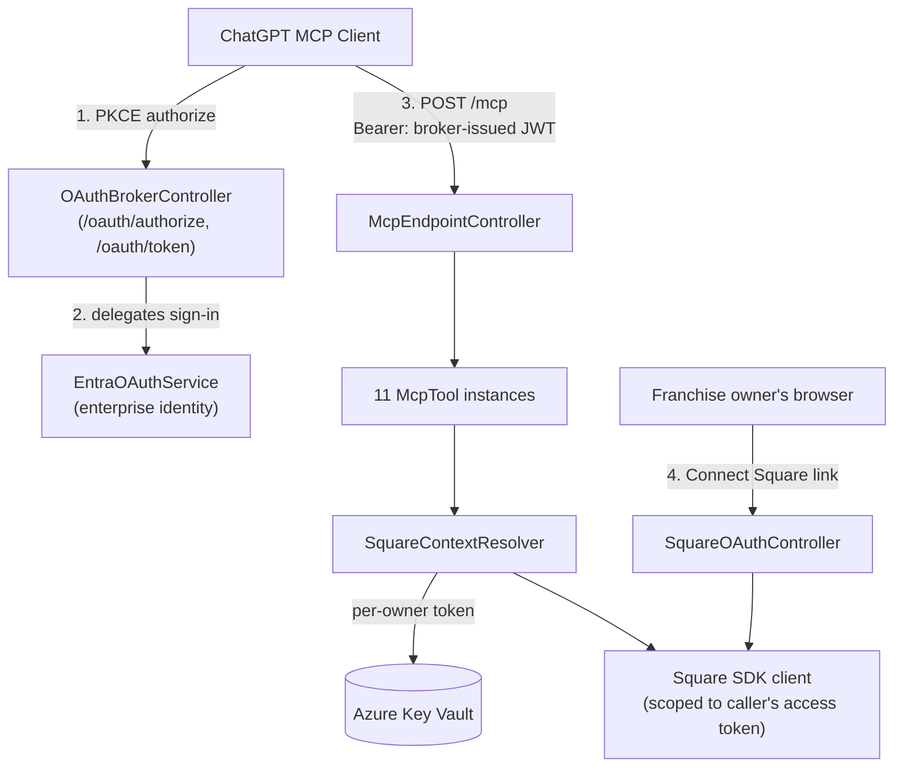

# Square Operations MCP Server — Technical Guide

## Alan Newbold (AI Engine) | developer@e-newbold.com

A self-hosted Node.js/Express [MCP](https://modelcontextprotocol.io) server, designed to run on Azure App Service, that exposes Square Labor operations (scheduling, timecards, payroll/tip reconciliation) as ChatGPT-consumable tools for franchise restaurant operators.

This guide covers **adopting and integrating** this server as a ChatGPT connector/App and understanding its tool catalog, identity model, and security posture. It does not cover Azure deployment/infrastructure setup. For the non-technical, owner-facing guide, see [ReadMe.md](ReadMe.md).

## Contents

- [Architecture overview](#architecture-overview)
- [Identity chain](#identity-chain)
- [Tool catalog reference](#tool-catalog-reference)
- [ChatGPT connector integration](#chatgpt-connector-integration)
- [Security model summary](#security-model-summary)
- [Known limitations](#known-limitations)
- [Extending the server](#extending-the-server)
- [Glossary](#glossary)

## Architecture overview

The composition root ([src/server/AppServer.js](src/server/AppServer.js)) wires every service and tool at startup. There are **two independent OAuth legs** — one proves the caller's enterprise identity, the other authorizes access to a specific Square merchant:

<strong>Why a custom OAuth broker exists</strong>

ChatGPT's MCP client requires the authorization server's discovery metadata to advertise `code_challenge_methods_supported: ["S256"]` (PKCE). Microsoft Entra ID's own discovery document doesn't reliably advertise this, so [OAuthBrokerController.js](src/web/routes/OAuthBrokerController.js) is a minimal, purpose-built PKCE authorization server that fronts an Entra sign-in and mints its own RS256-signed access token — scoped only to this MCP resource, never to Entra itself.

## Identity chain

1. **Enterprise identity (who is this business/owner?)** — [EntraOAuthService.js](src/services/EntraOAuthService.js) exchanges an Entra authorization code for a verified `{tenantId, objectId}` pair from the signed ID token.
2. **Broker access token** — [BrokerTokenSigner.js](src/services/BrokerTokenSigner.js) issues an RS256 JWT carrying `tid`/`oid` claims, verified per-request by [McpTokenVerifier.js](src/services/McpTokenVerifier.js) via the MCP SDK's `requireBearerAuth`.
3. **Square context resolution** — [SquareContextResolver.js](src/services/SquareContextResolver.js) maps `principalId` (`tenantId:objectId`) to a deterministic Key Vault secret name (`square-oauth-{tenantId}-{objectId}`), retrieves that owner's Square OAuth token (refreshing proactively at 75% of its validity window), and constructs a Square SDK client scoped to that token plus the `authorizedLocations` for that merchant.

Every tool call resolves its own `SquareContext` from the caller's principal — no tool ever accepts a raw `merchant_id`/`location_id` from the model; location authorization is enforced server-side via `SquareContext.requireAuthorizedLocation`.

## Tool catalog reference

| Tool                             | Type                            | Underlying Square SDK calls                                                  | Required OAuth scopes                       |
| -------------------------------- | ------------------------------- | ---------------------------------------------------------------------------- | ------------------------------------------- |
| `who_am_i`                       | read-only                       | `locations.list` (via context resolution)                                    | `MERCHANT_PROFILE_READ`                     |
| `square_connect_account`         | read-only                       | context resolution; issues a signed connect link on failure                  | —                                           |
| `prepare_payroll_reconciliation` | read-only                       | `labor.searchTimecards`                                                      | `TIMECARDS_READ`                            |
| `get_timecard_exceptions`        | read-only                       | `labor.searchTimecards`                                                      | `TIMECARDS_READ`                            |
| `reconcile_cash_tips`            | read-only (preview)             | `labor.searchTimecards` + deterministic allocation math                      | `TIMECARDS_READ`                            |
| `commit_cash_tips`               | **write, gated**                | `labor.retrieveTimecard` + `labor.updateTimecard`                            | `TIMECARDS_READ`, `TIMECARDS_WRITE`         |
| `search_scheduled_shifts`        | read-only                       | `labor.searchScheduledShifts`                                                | `TIMECARDS_READ`                            |
| `get_schedule_constraints`       | read-only                       | `labor.searchScheduledShifts` + `labor.workweekConfigs.list`                 | `TIMECARDS_READ`, `TIMECARDS_SETTINGS_READ` |
| `create_draft_schedule`          | write (draft only)              | `labor.searchScheduledShifts` (overlap check) + `labor.createScheduledShift` | `TIMECARDS_READ`, `TIMECARDS_WRITE`         |
| `update_draft_shift`             | write (draft only), destructive | `labor.retrieveScheduledShift` + `labor.updateScheduledShift`                | `TIMECARDS_WRITE`                           |
| `publish_schedule`               | **write, gated**                | `labor.retrieveScheduledShift` + `labor.bulkPublishScheduledShifts`          | `TIMECARDS_WRITE`                           |

Scopes above are validated against Square's live Labor API reference (`Permissions:` field per endpoint). `SquareOAuthService.SQUARE_OAUTH_SCOPES` ([SquareOAuthService.js](src/services/SquareOAuthService.js)) requests a superset — including `EMPLOYEES_READ` and `TIMECARDS_SETTINGS_WRITE` — which are currently unused by any tool (see [Known limitations](#known-limitations)).

Two tools implement **gated writes**:

- `commit_cash_tips` requires a `preview_token` minted by a prior `reconcile_cash_tips` call ([PreviewTokenSigner.js](src/services/PreviewTokenSigner.js)) — it can only commit an allocation that was actually computed by the server, never one asserted fresh by the model.
- `publish_schedule` and `commit_cash_tips` both re-read the current Square record (`version`/timecard state) immediately before writing, to satisfy Square's optimistic-concurrency requirement and avoid acting on stale data.

## ChatGPT connector integration

- **Discovery metadata** — [AppServer.js](src/server/AppServer.js) mounts `mcpAuthMetadataRouter` (RFC 8414/9728), advertising `code_challenge_methods_supported: ["S256"]`, the broker's `/oauth/authorize`, `/oauth/token`, and `/.well-known/jwks.json` endpoints.
- **Domain-ownership proof** — `/.well-known/openai-apps-challenge` serves a static token required for ChatGPT connector registration.
- **Transport** — [McpEndpointController.js](src/web/routes/McpEndpointController.js) uses a **stateless** Streamable HTTP transport (`sessionIdGenerator: undefined`) — a fresh transport is created per request, connected to one shared `McpServer` instance. There is no server-side conversation/session state; all continuity lives in the ChatGPT client.
- **Scheduled Tasks compatibility** — ChatGPT's scheduled/recurring tasks are **not supported with Custom GPTs**, only with direct Apps/connectors — relevant if this server is ever wrapped in a Custom GPT rather than exposed as a direct connector. Tasks also pause automatically when an action needs additional user confirmation, which aligns with this server's gated-write design (`commit_cash_tips`, `publish_schedule`) — an unattended scheduled run can safely execute the read-only/draft tools, then should pause rather than auto-approve a write.
- **Tool annotations** — each tool's `readOnlyHint`/`destructiveHint`/`idempotentHint` (see `static annotations` on each class in [src/tools/](src/tools/)) are the signal ChatGPT's client UI uses to decide whether to show its own confirmation prompt before invoking a tool — a second, client-side layer of human-in-the-loop independent of the server's own preview/draft gates.

## Security model summary

| Mechanism                                 | File                                                                                                                                                                               | Purpose                                                                                                            |
| ----------------------------------------- | ---------------------------------------------------------------------------------------------------------------------------------------------------------------------------------- | ------------------------------------------------------------------------------------------------------------------ |
| PKCE (S256) + signed authorization codes  | [OAuthBrokerController.js](src/web/routes/OAuthBrokerController.js)                                                                                                                | Standard OAuth code-interception protection for the ChatGPT sign-in leg                                            |
| HMAC-signed, principal-bound state tokens | [OAuthStateSigner.js](src/services/OAuthStateSigner.js)                                                                                                                            | Prevents a Square "connect" link minted for one owner from being replayed to attach another owner's Square account |
| HMAC-signed preview tokens (~15 min TTL)  | [PreviewTokenSigner.js](src/services/PreviewTokenSigner.js)                                                                                                                        | Ensures `commit_cash_tips` can only write an allocation the server itself computed                                 |
| RS256 broker access tokens + JWKS         | [BrokerTokenSigner.js](src/services/BrokerTokenSigner.js)                                                                                                                          | Lets ChatGPT verify tokens are issued by this server, published via `/.well-known/jwks.json`                       |
| Per-owner Key Vault secret isolation      | [SquareContextResolver.js](src/services/SquareContextResolver.js)                                                                                                                  | One Square OAuth connection per Entra principal, keyed deterministically, never shared across owners               |
| Server-side location authorization        | [SquareContext.js](src/services/SquareContext.js)                                                                                                                                  | The model can name a location; only server-side lookup against `authorizedLocations` decides if it's valid         |
| Optimistic concurrency re-reads           | [CommitCashTipsTool.js](src/tools/CommitCashTipsTool.js), [PublishScheduleTool.js](src/tools/PublishScheduleTool.js), [UpdateDraftShiftTool.js](src/tools/UpdateDraftShiftTool.js) | Always re-fetch current `version`/state immediately before a write, never reuse a version from an earlier read     |

## Known limitations

- **In-memory OAuth broker state** — `OAuthBrokerController`'s pending-request and authorization-code maps are process-local. Fine for a single instance; a restart or scale-out to multiple instances can drop in-flight sign-ins.
- **Hardcoded overtime threshold** — `ScheduledShiftService.OVERTIME_WEEKLY_HOURS_THRESHOLD = 40` is a US-federal default, not jurisdiction-aware.
- **No persisted scheduling "Rulebook"** — employee availability/preferences are handled conversationally only; there's no server-side store, so constraints don't carry over between separate ChatGPT conversations (a single ongoing scheduled task's thread is the closest approximation today).
- **Over-scoped OAuth request** — `EMPLOYEES_READ` and `TIMECARDS_SETTINGS_WRITE` are requested in `SQUARE_OAUTH_SCOPES` but no current tool exercises them (no `teamMembers`/`team.listJobs` calls, no workweek-config writes) — candidates for either trimming or building out the corresponding tools.
- **`workweekConfigs.list()` assumption** — `get_schedule_constraints` takes `page.data[0]`, assuming one workweek config per business; unverified against a multi-location seller with distinct configs.
- **Scheduling endpoints are Beta** — Square's `ScheduledShift` family (create/update/publish/search) is marked Beta in Square's own API reference.

## Extending the server

New tools follow a consistent pattern:

1. Extend `McpTool` ([base/McpTool.js](src/tools/base/McpTool.js)), which wraps `handler(args, principal)` in the MCP `CallToolResult` envelope and standard error handling.
2. Declare `static toolName`, `description`, `inputSchema`/`outputSchema` (Zod), and `annotations` (`readOnlyHint`/`destructiveHint`/`idempotentHint`) on the class.
3. Resolve a `SquareContext` via the injected `SquareContextResolver`, then call the relevant Square SDK client scoped to that context.
4. Register the new instance in the `tools` array in [AppServer.js](src/server/AppServer.js) — `ToolRegistry.registerAll` ([base/ToolRegistry.js](src/tools/base/ToolRegistry.js)) handles wiring it into the shared `McpServer`.

For any tool that writes data, follow the existing gated-write pattern: re-read current state immediately before writing, and require an explicit approval/preview mechanism for consequential actions rather than trusting the model to sequence steps correctly on its own.

## Glossary

| Term                          | Meaning                                                                                                                                   |
| ----------------------------- | ----------------------------------------------------------------------------------------------------------------------------------------- |
| **MCP**                       | Model Context Protocol — the standard this server implements to expose tools to ChatGPT and other MCP clients                             |
| **Principal**                 | The authenticated enterprise identity (`tenantId:objectId`) resolved from the broker-issued access token                                  |
| **Draft vs. published shift** | Square's native two-phase scheduling lifecycle — draft shifts are invisible to staff until explicitly published                           |
| **Preview token**             | A short-lived, server-signed token embedding a computed result (e.g. a tip allocation) that a later "commit" call must present unmodified |
| **Gated write**               | A tool that changes data in Square only after an explicit approval step, as opposed to a read-only/preview tool                           |
